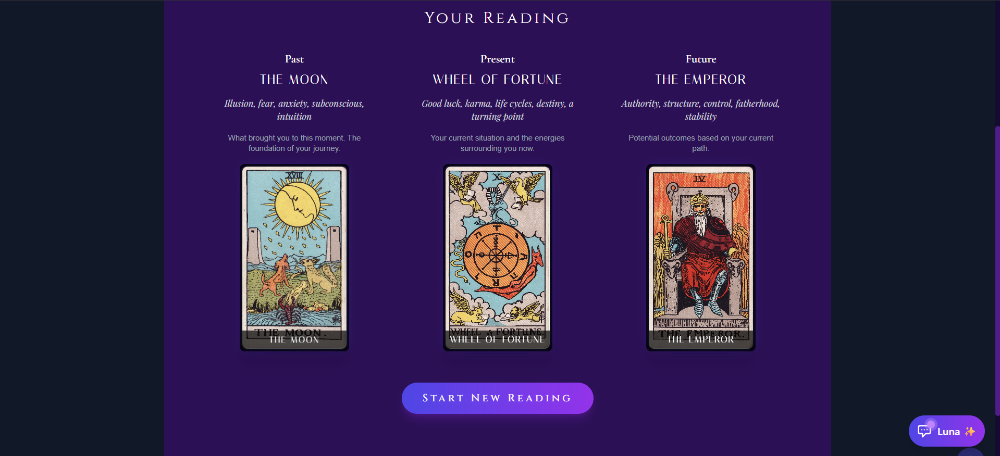
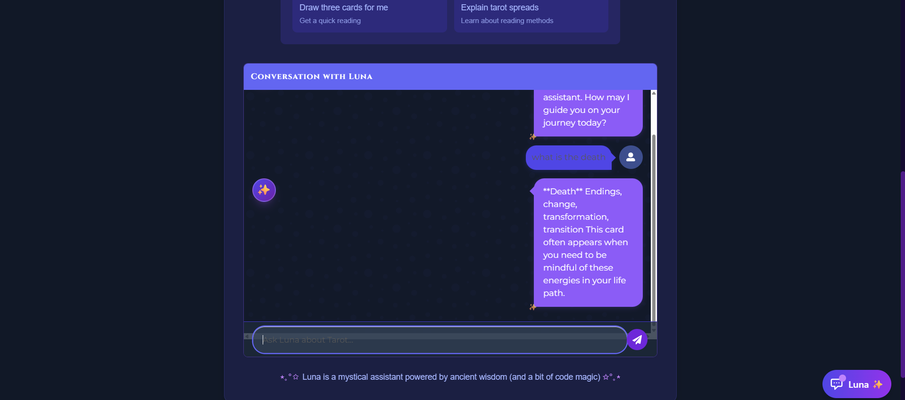

# 🔮 Tarot Reading Application

<div align="center">


A modern, interactive tarot card reading web application with beautiful animations and mystical design.

[✨ **Live Demo: Mystic Tarot** ✨](https://mystic-tarot-seven.vercel.app/)



</div>

## ✨ Features

- **Interactive Tarot Reading**: Draw and reveal cards with elegant animations
- **Responsive Design**: Optimized for all screen sizes (mobile, tablet, and desktop)
- **Past, Present, Future Reading**: Three-card spread with detailed interpretations
- **Beautiful UI**: Mystical, space-themed design with animated background
- **Card Animations**: Shuffling, selecting, and revealing animations
- **Landscape Detection**: Warning for optimal orientation on mobile devices

## 📱 App Functionality

### 🃏 Tarot Card Drawing Process

1. **Shuffling**: Begin your reading by shuffling the tarot deck with a beautiful animation
2. **Selection**: Choose three cards from the fan-spread deck, each representing past, present, and future
3. **Revelation**: Cards are automatically revealed with detailed interpretations of their meaning
4. **Interpretation**: Each card provides insights for your past influences, current situation, and potential future outcomes

### 🌟 User Experience Features

- **Animated Backgrounds**: Mystical starry background creates an immersive atmosphere
- **Responsive Layout**: Adapts seamlessly to any device size or orientation
- **Intuitive Navigation**: Clear instructions guide users through the reading process
- **Smooth Transitions**: Elegant animations between each stage of the reading
- **Card Details**: Each card displays its name, meaning, and time position (past/present/future)

### 🔄 Reading Flow

- Start a new reading with a single click
- Watch as the deck is shuffled with realistic animations
- Select cards from the beautifully displayed fan
- See your selected cards revealed with detailed interpretations
- Reflect on your reading and start a new one when ready

## 📱 Screenshots & Demo

### Card Reading Interface

<div align="center">
  
</div>

### Chatbot Assistant

<div align="center">
  
</div>

### Video Demonstration

<div align="center">
  
  [▶️ Watch the demonstration video](docs/recording.mp4)
  
</div>

## 🚀 Tech Stack

- **React 18**: Frontend library for building the user interface
- **TypeScript**: Type-safe JavaScript for enhanced developer experience
- **TailwindCSS**: Utility-first CSS framework for responsive design
- **Vite**: Fast build tool and development server
- **React Router**: Seamless navigation and routing
- **CSS Animations**: Custom animations for card interactions

## 🛠️ Getting Started

1. Clone the repository
```bash
git clone https://github.com/Riddhish1/Mystic-Tarot.git
cd Mystic-Tarot
```

2. Install dependencies
```bash
npm install
```

3. Start the development server
```bash
npm run dev
```

4. Open your browser to `http://localhost:5173`

## 🌐 Deployment

The application is deployed and accessible at:  
[https://mystic-tarot-seven.vercel.app/](https://mystic-tarot-seven.vercel.app/)

### Deployment Details

- **Platform**: Vercel
- **CI/CD**: Automatic deployments from the GitHub repository
- **Framework**: Configured for Vite applications

For information on how to deploy your own version, see [VERCEL_DEPLOYMENT.md](VERCEL_DEPLOYMENT.md)

## 📁 Project Structure

```
/
├── src/
│   ├── assets/        # Images and static resources
│   ├── components/    # Reusable UI components
│   ├── context/       # React context for state management
│   ├── pages/         # Application pages
│   ├── tabs/          # Tab components including DrawCards
│   └── utils/         # Utility functions and animations
├── docs/              # Documentation and media
│   ├── recording.mp4  # Demo video
│   ├── reading.png    # Screenshot of reading interface
│   └── chatbot.png    # Screenshot of chatbot interface
└── public/            # Public assets
```

## 🤝 Contributing

Contributions are welcome! Feel free to submit pull requests or open issues for any bugs or feature requests.

## 📄 License

This project is licensed under the MIT License. 